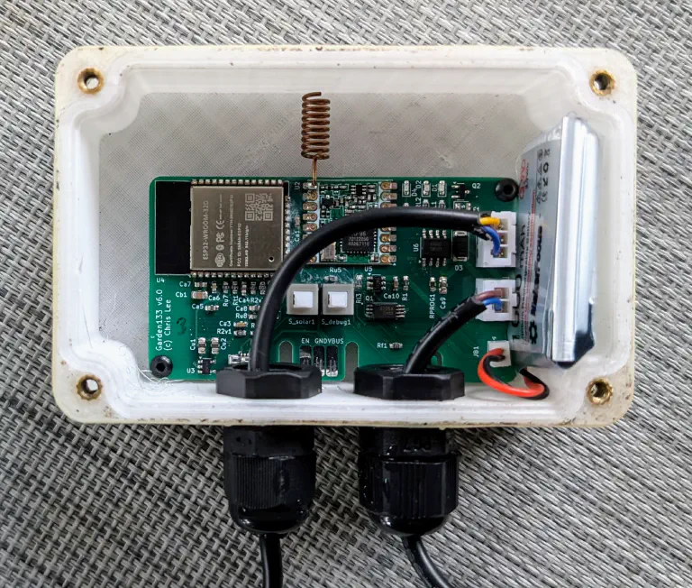
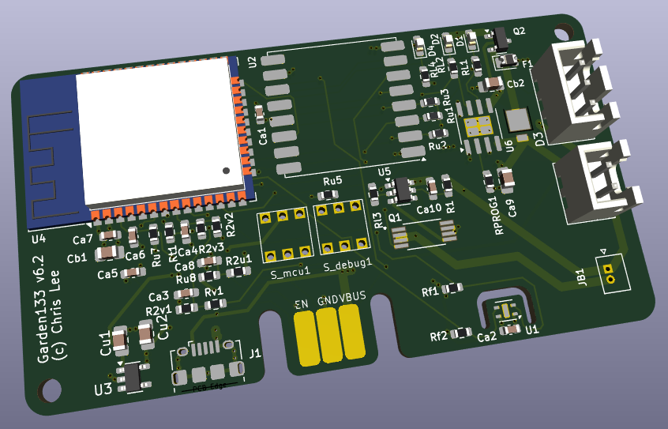

# Garden133

Garden133 is a solar and battery-powered device for monitoring garden soil moisture levels.
It reads the moisture level of soil using a capacitive moisture sensor.
Please see the [Introducing Garden133](https://selectiveappeal.org/posts/garden133/) blog post
for a project overview.

.

This project includes the KiCAD design and C++ firmware.
The firmware is built using the [Platformio](https://platformio.org/) build system.

The PCBA design is at [`KiCAD/Garden133/`](KiCAD/Garden133/).

The sensor board integrates with Home Assistant via a LoRa radio link to the
 [LoRa133](https://github.com/chl33/LoRa133) base station.

This device uses these libraries:
- [og3](https://github.com/chl33/og3). A basic C++ library for esp development in the Arduino environment.
- [og3x-lora](https://github.com/chl33/og3x-lora). LoRa module support for the og3 library.
- [og3x-satellite](https://github.com/chl33/og3x-satellite). A library that helps build a satellite architecture of a base station and satellite sensors.

More details to follow!
