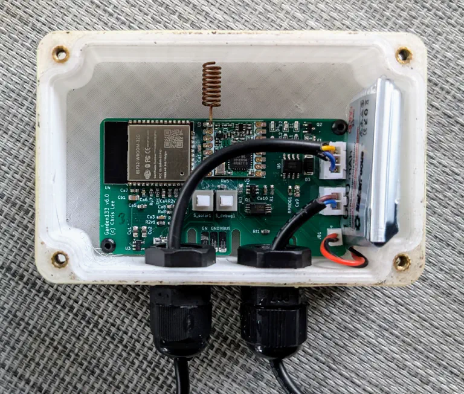
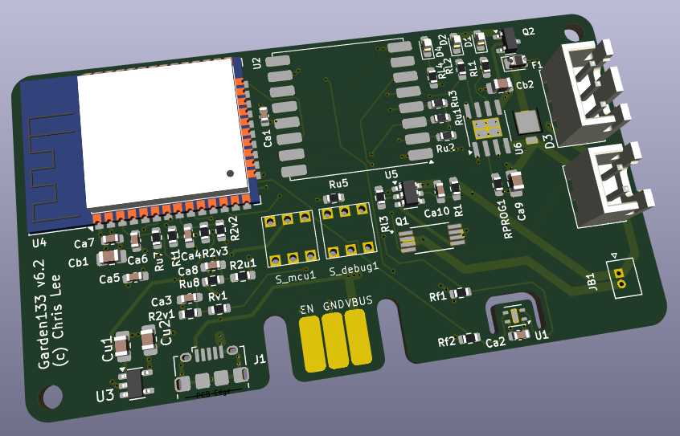

# Garden133 (v1.0.0)

Garden133 is a solar and battery-powered device for monitoring garden soil moisture levels.
It reads the moisture level of soil using a capacitive moisture sensor and transmits data via LoRa.

Please see the [Introducing Garden133](https://selectiveappeal.org/posts/garden133/) blog
post for a project overview.



## Features
- **Modern Web Interface:** A responsive Svelte-based UI for real-time status monitoring and calibration (accessible in Debug Mode).
- **Soil Moisture Sensing:** Capacitive sensor measurement with high-precision calibration.
- **Dedicated Calibration Page:** View live ADC counts to precisely tune dry/wet thresholds.
- **Device Environmental Monitoring:** SHTC3 sensor for air temperature and humidity inside the device enclosure.
- **Power Management:** Solar charging and battery voltage monitoring.
- **LoRa Communication:** Connects to a base station ([LoRa133](https://github.com/chl33/LoRa133)) to integrate with Home Assistant.
- **OTA Updates:** Support for wireless firmware updates.

## Hardware
This project includes the custom hardware design and 3D printable parts.

- **PCB Design:** KiCAD files are available in [`KiCAD/Garden133/`](KiCAD/Garden133/).
  
- **Enclosure:** OpenSCAD files for the waterproof enclosure and mounts are in [`OpenSCAD/`](OpenSCAD/).

## Firmware Dependencies
This firmware uses the [PlatformIO](https://platformio.org/) build system and depends on the following libraries:
- [og3](https://github.com/chl33/og3): Base C++ library for ESP32/Arduino.
- [og3x-lora](https://github.com/chl33/og3x-lora): LoRa module support.
- [og3x-satellite](https://github.com/chl33/og3x-satellite): Satellite architecture support.

## Getting Started

### Prerequisites
- [PlatformIO Core](https://docs.platformio.org/en/latest/core/index.html) or VSCode with PlatformIO extension.
- An ESP32-based Garden133 board.

### Configuration
The project uses INI files for local configuration (secrets, paths, etc.) which are excluded from git.

1. **Setup Secrets:**
   Copy the example secrets file to create your local configuration:
   ```bash
   cp secrets.ini.example secrets.ini
   ```
   Edit `secrets.ini` to set your environment preferences:
   - `udpLogTarget`: IP address for UDP logging.
   - `otaPassword`: Password for Over-The-Air updates.
   - `uploadProtocol`: `esptool` (USB) or `espota` (WiFi).
   - `uploadPort`: Serial port (e.g., `/dev/ttyUSB0`) or IP address.

2. **USB vs WiFi:**
   You can also use `secrets-usb.ini.example` as a template for USB-connected development:
   ```bash
   cp secrets-usb.ini.example secrets.ini
   ```

### Building & Flashing

1. **Build the firmware:**
   ```bash
   pio run
   ```

2. **Upload the firmware:**
   ```bash
   pio run --target upload
   ```

3. **Upload Filesystem (LittleFS):**
   This uploads the `data/` directory containing web resources.
   ```bash
   pio run --target uploadfs
   ```

## License
This project is licensed under the MIT License. See `LICENSE` for details.
